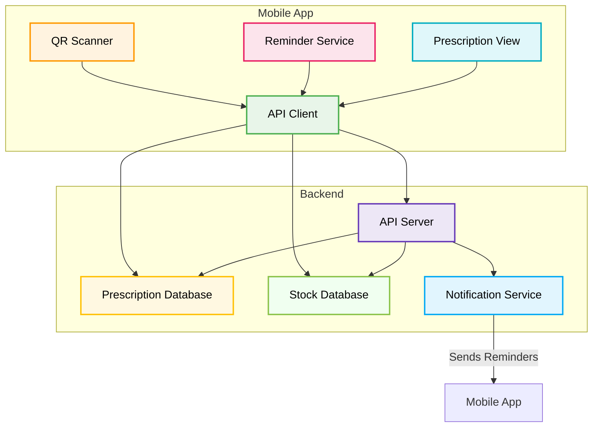

# MediTrack Architecture

## 1. Context Diagram

### Container Diagram

```mermaid
graph TD;
    subgraph Mobile App
        A[Prescription View]
        B[Reminder Service]
        C[QR Scanner]
        D[API Client]
    end
    subgraph Backend
        E[API Server]
        F[Prescription Database]
        G[Stock Database]
        H[Notification Service]
    end
    A --> D
    B --> D
    C --> D
    D --> E
    E --> F
    E --> G
    E --> H
    D --> F
    D --> G
    H -->|Sends Reminders| Mobile[Mobile App]

    style A fill:#E0F7FA,stroke:#00ACC1,stroke-width:2px,color:#000;
    style B fill:#FCE4EC,stroke:#E91E63,stroke-width:2px,color:#000;
    style C fill:#FFF3E0,stroke:#FF9800,stroke-width:2px,color:#000;
    style D fill:#E8F5E9,stroke:#4CAF50,stroke-width:2px,color:#000;
    style E fill:#EDE7F6,stroke:#673AB7,stroke-width:2px,color:#000;
    style F fill:#FFF8E1,stroke:#FFC107,stroke-width:2px,color:#000;
    style G fill:#F0FFF0,stroke:#8BC34A,stroke-width:2px,color:#000;
    style H fill:#E1F5FE,stroke:#03A9F4,stroke-width:2px,color:#000;
```