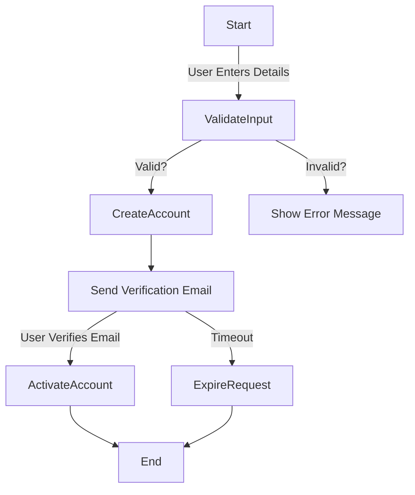
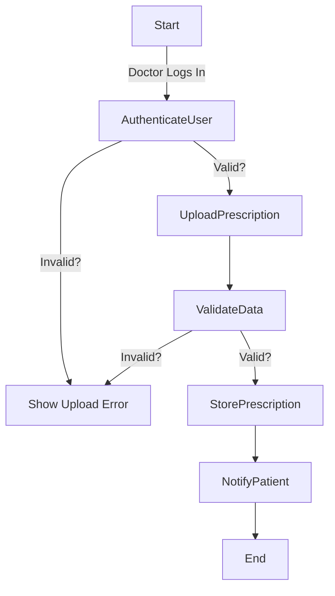
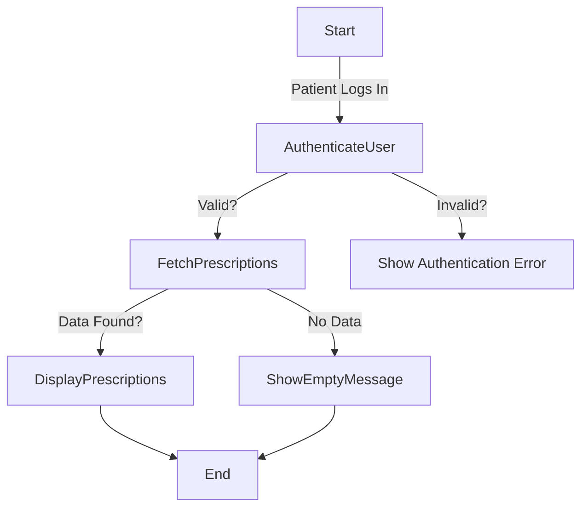
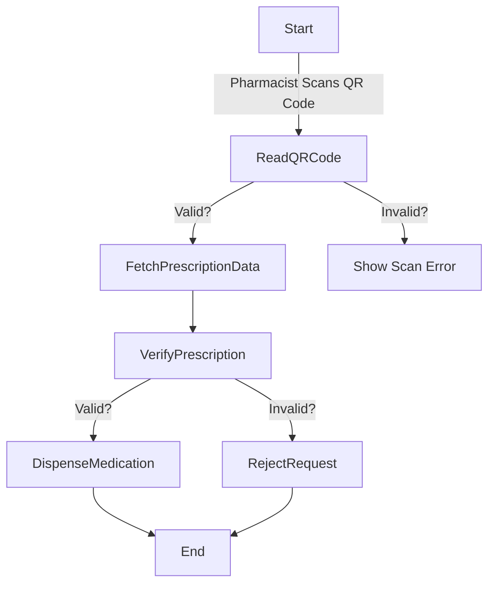
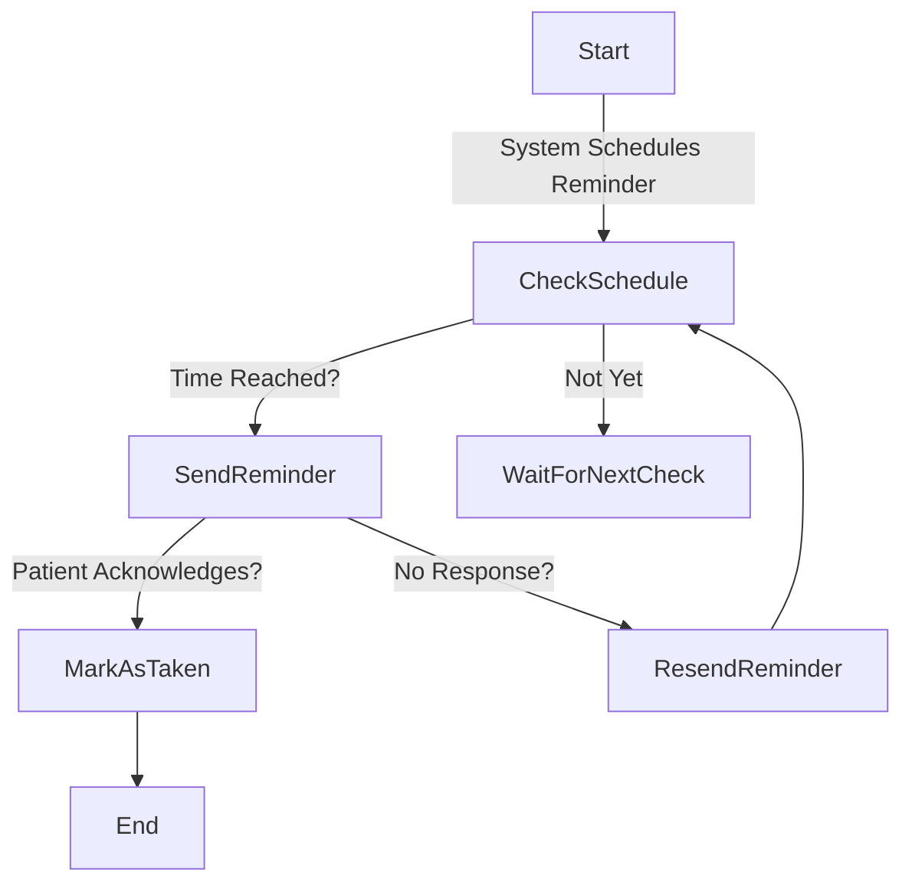
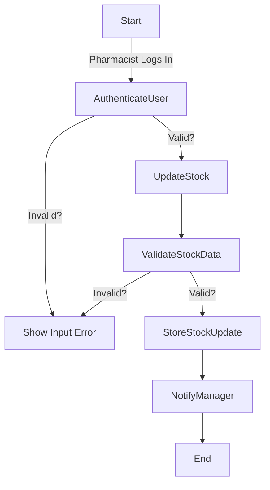
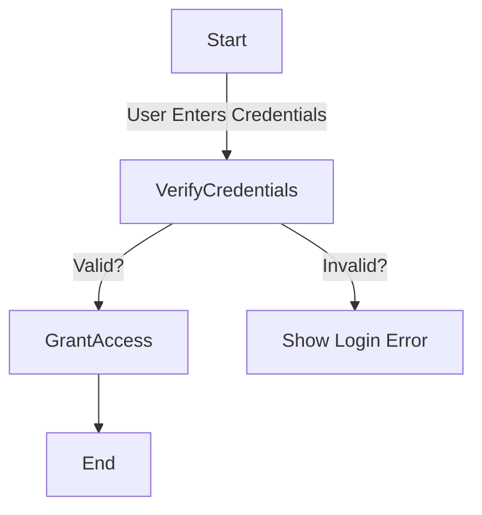
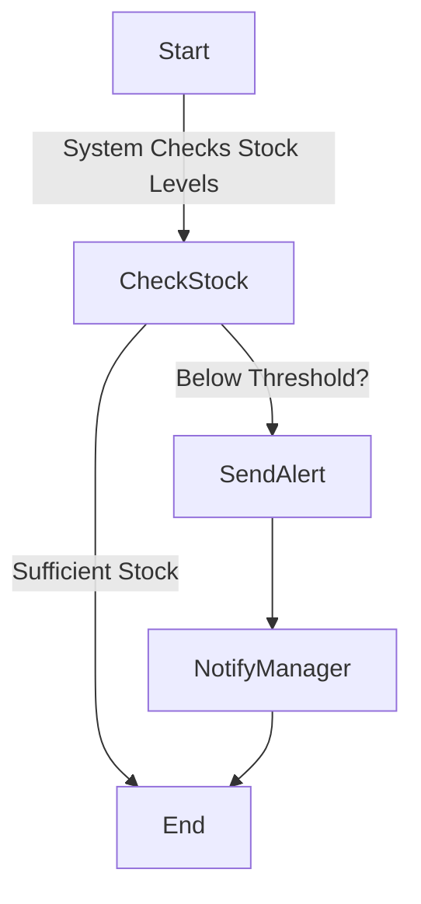

# MediTrack Activity Workflow Modeling

## 1. User Registration Workflow

### Explanation
- This workflow ensures secure registration by requiring email verification.
- The **validation step** prevents incorrect data entry.
- **Parallel actions** (sending verification email) improve user experience.

## 2. Prescription Upload Workflow

### Explanation
- Ensures only **authenticated doctors** can upload prescriptions.
- **Validation step** prevents incomplete data entry.
- **Notification step** informs patients in real-time.

## 3. Prescription Viewing Workflow

### Explanation
- **Authentication step** ensures patient privacy.
- **Fetch prescriptions step** retrieves data securely.
- **Empty message step** enhances user experience.

## 4. QR Code Verification Workflow

### Explanation
- Ensures **authenticity** of prescriptions.
- **Validation steps** prevent fraudulent prescriptions.
- **Error handling** improves security compliance.

## 5. Medication Reminder Workflow

### Explanation
- Ensures **medication adherence** with timely reminders.
- **Resending step** ensures notifications are not missed.
- **Acknowledgment tracking** helps caregivers monitor adherence.

## 6. Stock Level Update Workflow

### Explanation
- **Authentication ensures security.**
- **Validation step prevents incorrect stock data.**
- **Notifications improve inventory awareness.**

## 7. User Authentication Workflow

### Explanation
- **Simple and secure login system.**
- **Error handling prevents unauthorized access.**

## 8. Low Stock Notification Workflow

### Explanation
- **Automates inventory monitoring.**
- **Reduces risk of medication shortages.**
