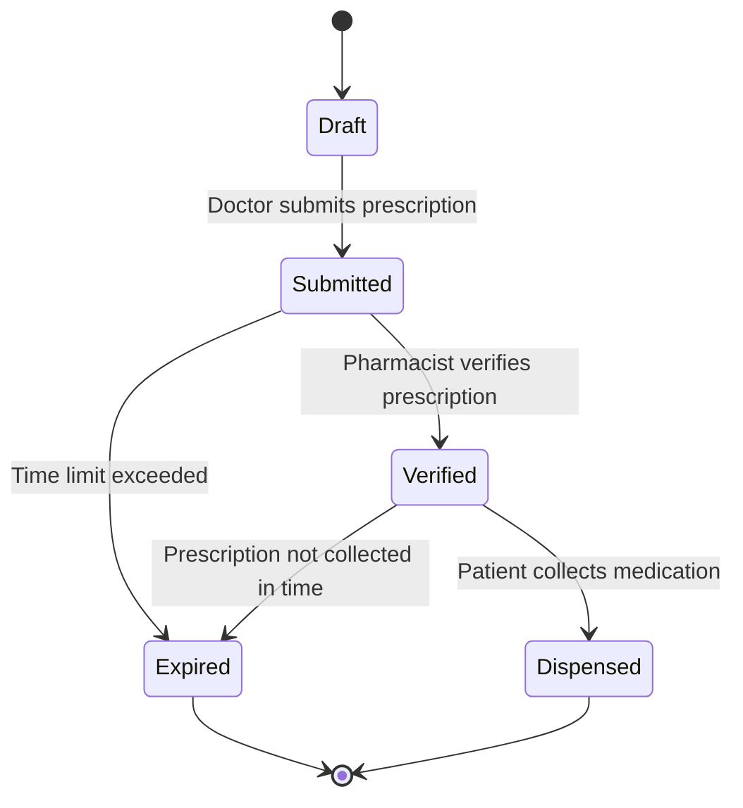
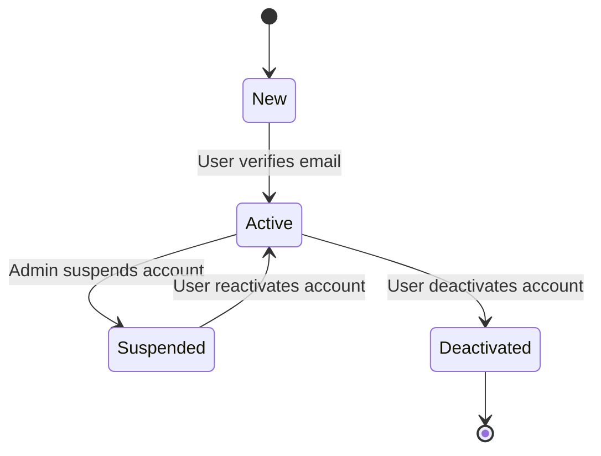
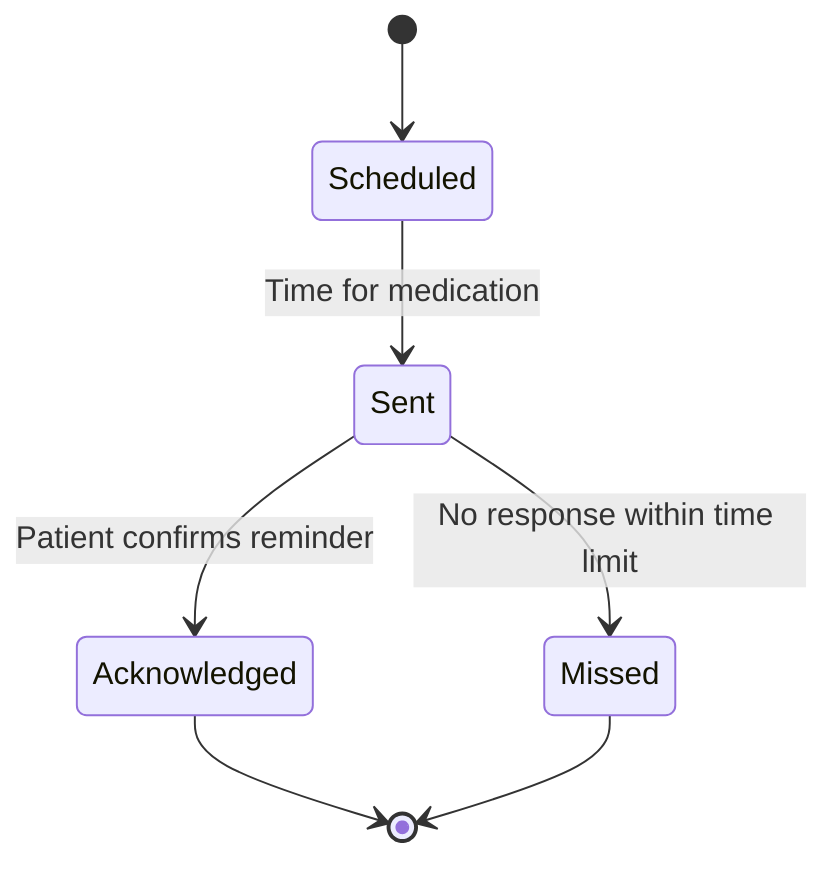
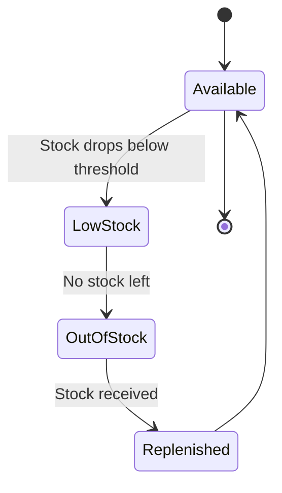
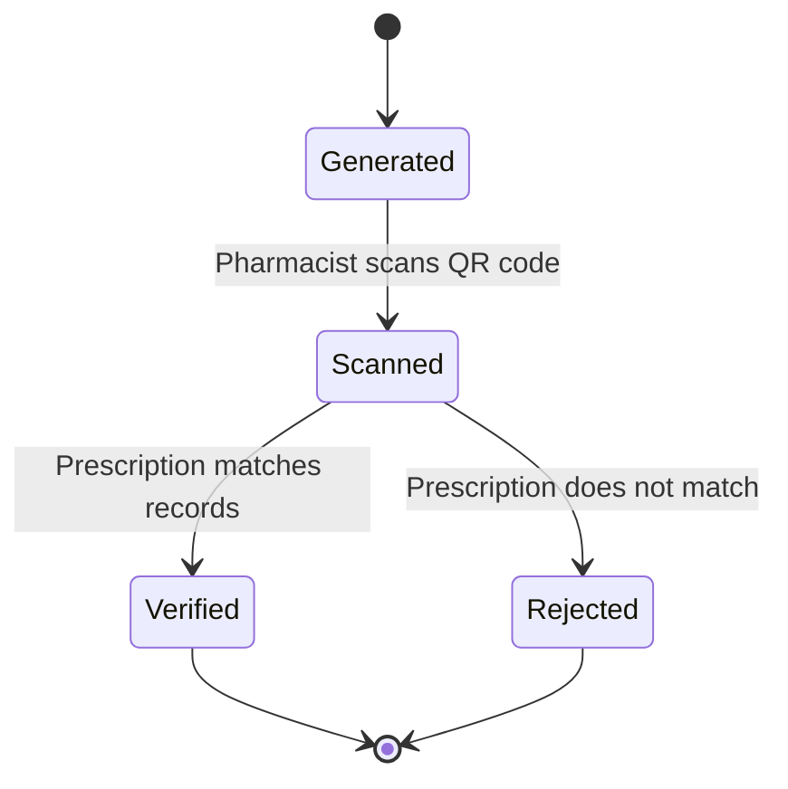
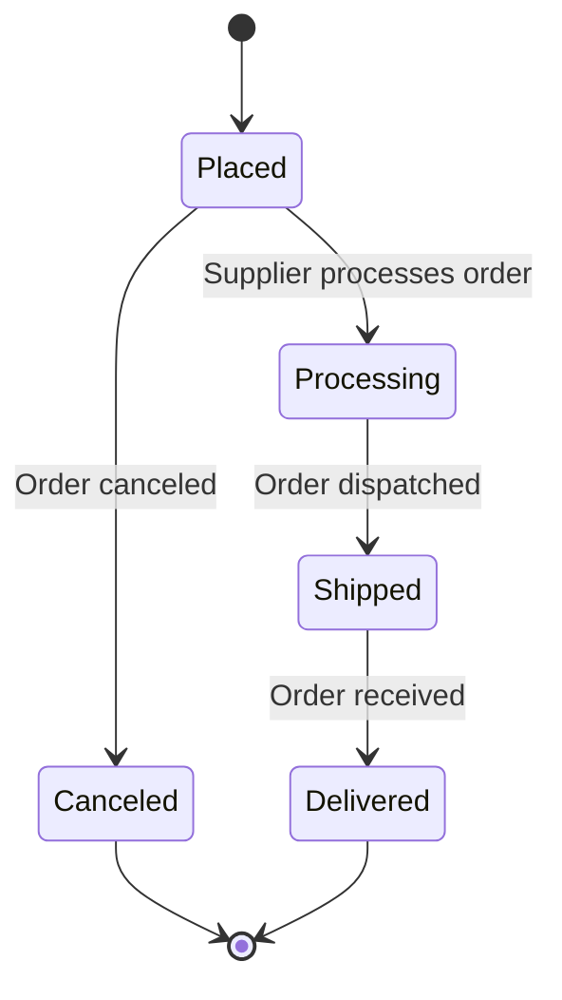
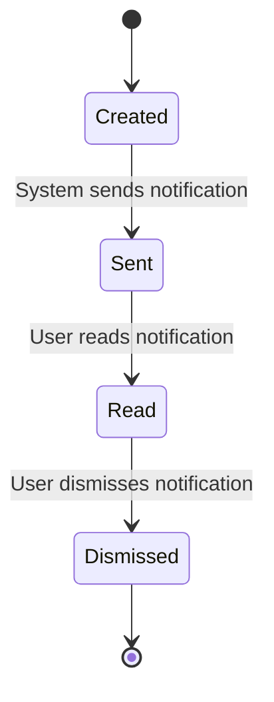
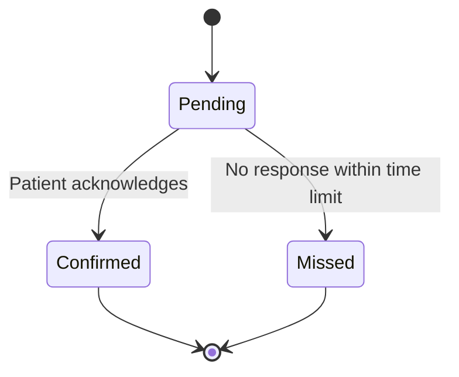

# MediTrack State Transition Diagrams

## 1. Prescription Object
### **Key States:**
- **Draft:** Doctor starts creating a prescription.
- **Submitted:** Doctor finalizes and submits the prescription.
- **Verified:** Pharmacist scans the prescription and verifies it.
- **Dispensed:** Patient collects medication.
- **Expired:** Prescription is no longer valid.

### **Transitions:**
- **Doctor submits prescription → Moves to ‘Submitted’.**
- **Pharmacist verifies prescription → Moves to ‘Verified’.**
- **Patient collects medication → Moves to ‘Dispensed’.**
- **Time limit exceeded → Moves to ‘Expired’.**

---

## 2. User Account Object
### **Key States:**
- **New:** User registers an account.
- **Active:** User verifies email and logs in.
- **Suspended:** Account is temporarily disabled.
- **Deactivated:** User chooses to deactivate the account.

### **Transitions:**
- **User registers → Moves to ‘New’.**
- **User verifies email → Moves to ‘Active’.**
- **Admin suspends account → Moves to ‘Suspended’.**
- **User reactivates account → Moves back to ‘Active’.**
- **User requests deletion → Moves to ‘Deactivated’.**

---

## 3. Reminder Object
### **Key States:**
- **Scheduled:** System schedules a medication reminder.
- **Sent:** Reminder is sent to the patient.
- **Acknowledged:** Patient confirms receiving the reminder.
- **Missed:** Patient does not acknowledge the reminder in time.

### **Transitions:**
- **Reminder scheduled → Moves to ‘Scheduled’.**
- **Time for medication → Moves to ‘Sent’.**
- **Patient acknowledges → Moves to ‘Acknowledged’.**
- **Time limit exceeded → Moves to ‘Missed’.**

---

## 4. Medication Stock Object
### **Key States:**
- **Available:** Medication is in stock.
- **Low Stock:** Medication stock drops below the threshold.
- **Out of Stock:** Medication is fully depleted.
- **Replenished:** New stock is added.

### **Transitions:**
- **Stock drops below threshold → Moves to ‘Low Stock’.**
- **Stock reaches zero → Moves to ‘Out of Stock’.**
- **New supply added → Moves to ‘Replenished’.**

---

## 5. QR Code Verification Object
### **Key States:**
- **Generated:** System generates a QR code.
- **Scanned:** Pharmacist scans the QR code.
- **Verified:** Prescription details are authenticated.
- **Rejected:** Verification fails.

### **Transitions:**
- **System generates QR code → Moves to ‘Generated’.**
- **Pharmacist scans QR code → Moves to ‘Scanned’.**
- **System verifies details → Moves to ‘Verified’.**
- **Mismatch found → Moves to ‘Rejected’.**

---

## 6. Order Object (Stock Refill)
### **Key States:**
- **Placed:** Order request is made.
- **Processing:** Order is being prepared.
- **Shipped:** Order is shipped.
- **Delivered:** Order arrives at pharmacy.
- **Canceled:** Order is canceled.

### **Transitions:**
- **Pharmacy places an order → Moves to ‘Placed’.**
- **Supplier starts processing → Moves to ‘Processing’.**
- **Order shipped → Moves to ‘Shipped’.**
- **Order delivered → Moves to ‘Delivered’.**
- **Order canceled before shipping → Moves to ‘Canceled’.**

---

## 7. System Notification Object
### **Key States:**
- **Created:** System generates a notification.
- **Sent:** Notification is delivered.
- **Read:** User reads the notification.
- **Dismissed:** User dismisses the notification.

### **Transitions:**
- **System triggers notification → Moves to ‘Created’.**
- **Notification sent to user → Moves to ‘Sent’.**
- **User opens notification → Moves to ‘Read’.**
- **User dismisses notification → Moves to ‘Dismissed’.**

---

## 8. Patient Acknowledgment Object
### **Key States:**
- **Pending:** Waiting for patient action.
- **Confirmed:** Patient acknowledges medication intake.
- **Missed:** Patient does not confirm intake in time.

### **Transitions:**
- **Reminder sent → Moves to ‘Pending’.**
- **Patient confirms → Moves to ‘Confirmed’.**
- **No response within time limit → Moves to ‘Missed’.**

---

## Conclusion
These state transition diagrams define the dynamic behavior of key MediTrack objects. By modeling these states, the system ensures smooth handling of prescriptions, user authentication, stock management, and patient reminders.
